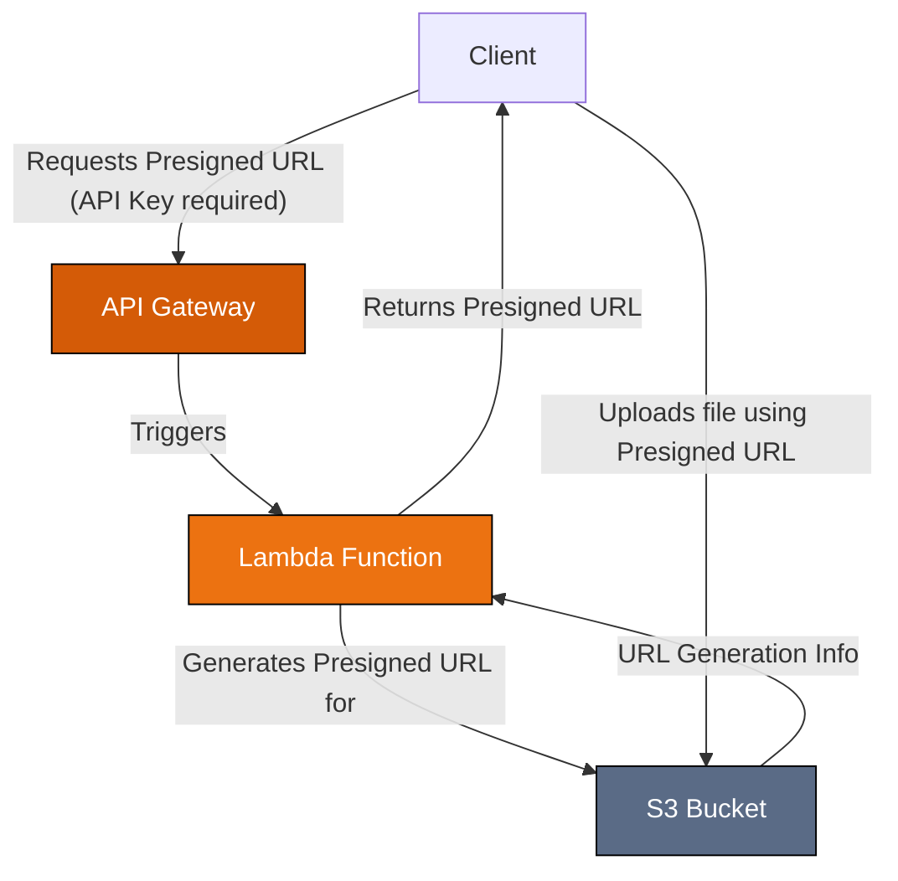
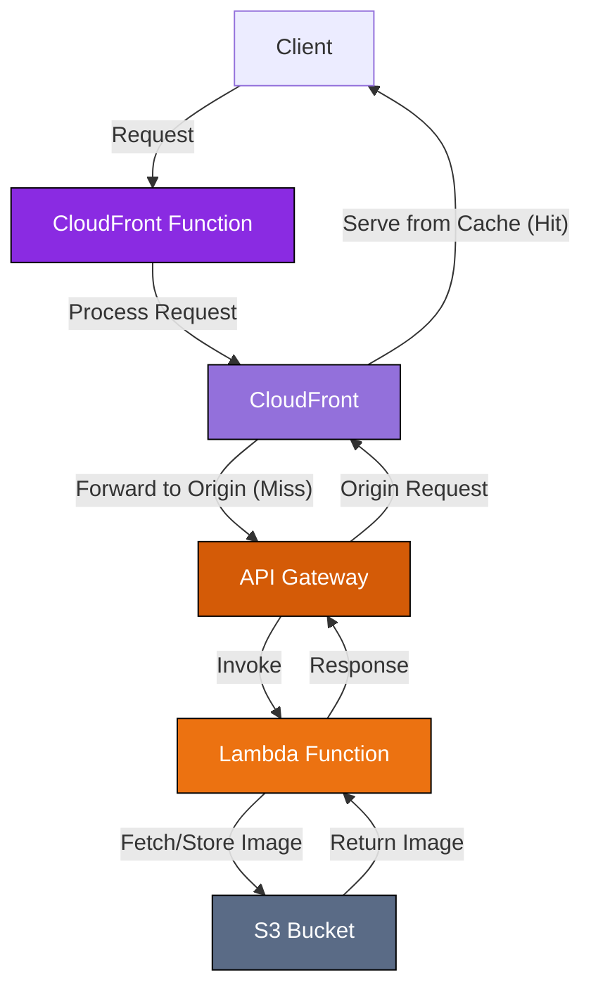

# Image Optimization Api

AWS의 Dynamic Image Transformation for Amazon CloudFront 솔루션을 사용하여, 적은 비용으로 실시간 이미지 변환 및 최적화를 제공하는 API를 구성합니다.

## Architecture

### 1. Uploader



### 2. Transformer



> **참고:** Uploader와 Transformer는 동일한 S3 버킷을 사용하여 원본 이미지를 저장하고 관리합니다.

## 주요 기능

- **간소화된 이미지 최적화**: 간단한 API 요청으로 실시간 이미지 변환 및 최적화를 수행합니다. 브라우저 기능에 맞춰 가장 효율적인 형식을 제공하고, 파일 크기와 품질을 최적화합니다.
- **확장 가능한 아키텍처**: 서버리스 아키텍처를 통해 다양한 부하를 자동으로 처리합니다. 인프라 관리 없이도 트래픽 급증 시 일관된 성능을 유지합니다.
- **비용 효율적인 스토리지 관리**: 원본 이미지만 저장하고 필요할 때 변형된 이미지를 생성합니다. 동일 이미지의 여러 버전이 필요 없어 스토리지 비용을 크게 절감합니다.
- **고급 보안 제어**: URL 서명, 요청 검증, 콘텐츠 조정 기능으로 시각적 자산을 보호하며, 이미지 전송에 대한 세분화된 접근 제어를 유지합니다.

## 빌드 및 배포

먼저, 배포할 AWS 리전을 설정합니다. `.env.region.example` 파일을 복사하여 `.env.region` 파일을 만들고 해당 리전 정보를 입력합니다. 예: `AWS_REGION=ap-northeast-2`

### 1. Uploader

Uploader를 배포하기 전에, `.env.uploader.example` 파일을 복사하여 `.env.uploader` 파일을 생성하고 필요한 환경 변수를 설정합니다.

```sh
npm run deploy:uploader
```

### 2. Transformer

Transformer를 배포하기 전에, `.env.transformer.example` 파일을 복사하여 `.env.transformer` 파일을 생성하고 필요한 환경 변수를 설정합니다.

```sh
npm run deploy:transformer
```

## 비용

미국 동부(버지니아 북부) 리전을 기준으로, 신규 이미지 100,000개를 처리할 경우 예상 월 비용은 약 5.30달러입니다.

## API Endpoint

### 1. S3 업로드 Presigned URL 생성

이 엔드포인트는 S3 버킷에 파일을 직접 업로드하는 데 사용할 수 있는 미리 서명된 URL(presigned URL)을 생성합니다.

**Endpoint:** `POST /` (API Gateway를 통해 `upload.yourdomain.com`과 같이 기본 URL이 구성되었다고 가정)

**Request:**

- **메서드:** `POST`
- **헤더:**
  - `Content-Type: application/json`
- **본문:**

  ```json
  {
    "key": "string" // S3 버킷 내 원하는 객체 키 (파일 이름)
  }
  ```

**Response:**

- **성공 (200 OK):**

  ```json
  {
    "preSignedUrl": "string", // 파일 업로드를 위한 생성된 미리 서명된 URL
    "key": "string" // 요청에 제공된 객체 키
  }
  ```

- **오류:**
  - `400 Bad Request`: `key`가 누락된 경우.
  - `413 Payload Too Large`: AWS Lambda는 요청 및 응답 모두에 대해 6MB의 페이로드 크기 제한이 있습니다. 요청 본문(JSON 구조 및 키 포함)이 이 제한을 초과하거나 생성된 응답(미리 서명된 URL 및 키 포함)이 이 제한을 초과하면 `413` 오류가 발생합니다. 이 제한은 Lambda 호출 페이로드에 적용되며, 미리 서명된 URL 자체를 사용하여 S3에 업로드되는 파일의 크기에는 적용되지 않습니다. 파일 업로드 크기 제한은 S3 및 미리 서명된 URL 구성에 따라 결정됩니다.
  - `500 Internal Server Error`: 예상치 못한 서버 문제가 발생한 경우.

**참고:**

- `preSignedUrl`을 사용한 실제 S3 업로드의 `Content-Type`은 `key`에 제공된 파일 확장자를 기반으로 자동으로 결정됩니다.
- 미리 서명된 URL에는 제한된 만료 시간(기본값 300초)이 있습니다.

### 2. 이미지 변환 및 조회

이 엔드포인트는 S3 버킷에 저장된 원본 이미지를 실시간으로 변환하고 조회하는 기능을 제공합니다.

**Endpoint:** `GET /<이미지 경로>?<쿼리 파라미터>` (기본 URL이 `image.yourdomain.com`으로 구성되었다고 가정)

- `<이미지 경로>`: S3 버킷에 저장된 원본 이미지의 경로 (예: `assets/brand/logo.png`)

**Query Parameters:**

| 파라미터 | 설명                                  | 옵션                                                               | 기본값    |
| -------- | ------------------------------------- | ------------------------------------------------------------------ | --------- |
| `format` | 출력 이미지 포맷을 설정합니다.        | `jpg`, `jpeg`, `png`, `webp`, `gif`, `avif`, `tiff`, `heic`, `raw` | 원본 포맷 |
| `fit`    | 이미지 크기 조정 방식을 설정합니다.   | `cover`, `contain`, `fill`, `inside`, `outside`                    | `cover`   |
| `width`  | 이미지 너비를 픽셀 단위로 설정합니다. | 양의 정수 또는 0                                                   | 원본 너비 |
| `height` | 이미지 높이를 픽셀 단위로 설정합니다. | 양의 정수 또는 0                                                   | 원본 높이 |

**예시:**

`https://image.yourdomain.com/assets/brand/logo.png?format=webp&width=300&height=200&fit=contain`

- 원본 이미지: `assets/brand/logo.png`
- 변환 요청:
  - 포맷: WebP
  - 너비: 300px
  - 높이: 200px
  - 크기 조정 방식: contain (원본 비율 유지하며 지정된 크기 안에 맞춤)

**응답:**

- **성공 (200 OK):** 변환된 이미지 데이터가 반환됩니다. `Content-Type` 헤더는 요청한 `format`에 맞게 설정됩니다.
- **오류:**
  - `400 Bad Request`: URL이 만료된 경우.
  - `404 Not Found`: 지정한 경로에서 원본 이미지를 찾을 수 없는 경우.
  - `500 Internal Server Error`: 잘못된 쿼리 파라미터 값을 제공하거나 이미지 처리 중 예상치 못한 오류가 발생한 경우.

## FAQ

### 사용자 정의 도메인(CNAME)을 CloudFront Distribution에 연결하는 방법

CloudFront Distribution에 사용자 정의 도메인(예: `image.yourdomain.com`)을 연결하려면 다음 단계를 따르세요.

1. AWS Management Console에서 CloudFront 서비스로 이동하여 해당 Distribution의 설정을 엽니다.
2. 'Settings' 섹션에서 'Edit'을 클릭하고, 'Alternate domain name (CNAME)' 필드에 사용하려는 사용자 정의 도메인을 입력합니다.
3. 'Custom SSL certificate' 섹션에서 해당 도메인에 맞는 SSL 인증서를 선택합니다. **중요:** CloudFront에서 사용자 정의 SSL 인증서를 사용하려면 반드시 `us-east-1` 리전에 생성된 인증서여야 합니다.
4. AWS Management Console에서 Route 53 서비스로 이동합니다.
5. 해당 도메인의 Hosted zone을 선택합니다.
6. 'Create record'를 클릭하여 새 레코드를 생성합니다. 레코드 유형은 'A'를 선택하고, 'Alias' 옵션을 활성화합니다. 'Route traffic to' 옵션에서 'Alias to CloudFront distribution'을 선택한 후, 해당 Distribution을 선택합니다. 마지막으로 'Create records'를 클릭하여 레코드를 생성합니다.

## 참고 문서

- [Dynamic Image Transformation for Amazon CloudFront](https://aws.amazon.com/solutions/implementations/dynamic-image-transformation-for-amazon-cloudfront)
