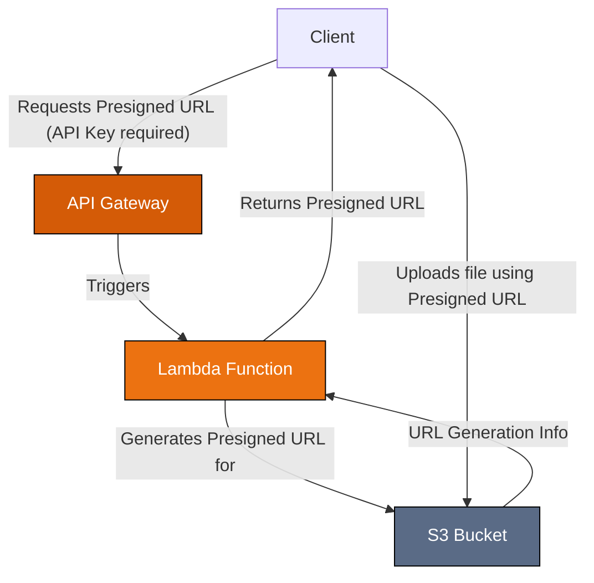
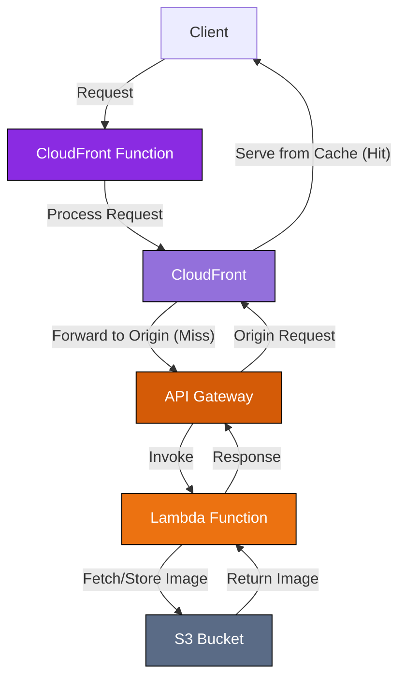

# Software Design Document: Image Optimization API

## 1. 개요

이 문서는 이미지 최적화 API (Image Optimization API) 서비스의 설계를 설명합니다. 이 서비스는 AWS 서비스를 활용하여 비용 효율성과 확장성을 갖춘 실시간 이미지 변환 (transformation) 및 최적화 (optimization) 기능을 제공합니다. 주요 목표는 사용자가 원본 이미지를 업로드한 후 간단한 URL 매개변수 (parameter)를 통해 즉석에서 다양한 최적화 및 변환된 버전의 이미지를 요청할 수 있도록 하여 이미지 처리를 단순화하는 것입니다.

이 문서는 API와 통합하는 개발자 및 시스템을 유지 관리하는 엔지니어를 대상으로 합니다.

## 2. 시스템 아키텍처

이 서비스는 Uploader와 Transformer라는 두 가지 주요 구성 요소로 이루어집니다.

### 2.1. Uploader

Uploader 구성 요소는 원본 이미지를 S3 bucket으로 안전하게 업로드하는 과정을 용이하게 합니다.



### 2.2. Transformer

Transformer 구성 요소는 CloudFront를 통해 실시간 이미지 처리 및 전송을 처리합니다.



> **참고:** Uploader와 Transformer는 동일한 S3 버킷을 사용하여 원본 이미지를 저장하고 관리합니다.

## 3. Data Design

- **주 저장소 (Primary Storage):** 단일 S3 버킷 (S3 bucket)이 모든 원본 업로드 이미지의 신뢰할 수 있는 소스 (authoritative source) 역할을 합니다.
- **데이터 관리 (Data Management):** 원본 이미지만 영구적으로 저장됩니다. 변환된 버전은 요청 시 생성되어 CloudFront에 의해 캐시됩니다. 다양한 이미지 변형을 위해 별도의 저장 공간이 필요하지 않아 저장 비용을 크게 절감합니다.
- **데이터 구조 (Data Structure):** 이미지는 업로드 과정에서 제공된 객체 키 (object key) (예: `assets/brand/logo.png`)를 사용하여 S3 버킷 내에서 구성됩니다.

## 4. API Endpoints

### 4.1. S3 업로드 Presigned URL 생성

이 엔드포인트는 S3 버킷에 파일을 직접 업로드하는 데 사용할 수 있는 미리 서명된 URL(presigned URL)을 생성합니다.

**Endpoint:** `POST /` (API Gateway를 통해 `upload.yourdomain.com`과 같이 기본 URL이 구성되었다고 가정)

**Request:**

- **메서드:** `POST`
- **헤더:**
  - `Content-Type: application/json`
- **본문:**

  ```json
  {
    "key": "string" // S3 버킷 내 원하는 객체 키 (파일 이름)
  }
  ```

**Response:**

- **성공 (200 OK):**

  ```json
  {
    "preSignedUrl": "string", // 파일 업로드를 위한 생성된 미리 서명된 URL
    "key": "string" // 요청에 제공된 객체 키
  }
  ```

- **오류:**
  - `400 Bad Request`: `key`가 누락된 경우.
  - `413 Payload Too Large`: AWS Lambda는 요청 및 응답 모두에 대해 6MB의 페이로드 크기 제한이 있습니다. 요청 본문(JSON 구조 및 키 포함)이 이 제한을 초과하거나 생성된 응답(미리 서명된 URL 및 키 포함)이 이 제한을 초과하면 `413` 오류가 발생합니다. 이 제한은 Lambda 호출 페이로드에 적용되며, 미리 서명된 URL 자체를 사용하여 S3에 업로드되는 파일의 크기에는 적용되지 않습니다. 파일 업로드 크기 제한은 S3 및 미리 서명된 URL 구성에 따라 결정됩니다.
  - `500 Internal Server Error`: 예상치 못한 서버 문제가 발생한 경우.

**참고:**

- `preSignedUrl`을 사용한 실제 S3 업로드의 `Content-Type`은 `key`에 제공된 파일 확장자를 기반으로 자동으로 결정됩니다.
- 미리 서명된 URL에는 제한된 만료 시간(기본값 300초)이 있습니다.

### 4.1.1. 클라이언트 측 업로드 예제

다음은 클라이언트 측 JavaScript 코드 예시로, 발급받은 `preSignedUrl`을 사용하여 파일을 S3에 업로드하는 방법을 보여줍니다.

```ts
const response = await fetch("generated-presigned-url", {
  method: "PUT",
  headers: {
    "Content-Type": file.type,
    "X-API-Key": "API key",
  },
  body: file, // 'file' 변수는 <input type="file"> 요소 등에서 얻은 File 객체라고 가정
});
```

### 4.2. 이미지 변환 및 조회

이 엔드포인트는 S3 버킷에 저장된 원본 이미지를 실시간으로 변환하고 조회하는 기능을 제공합니다.

**Endpoint:** `GET /<이미지 경로>?<쿼리 파라미터>` (기본 URL이 `image.yourdomain.com`으로 구성되었다고 가정)

- `<이미지 경로>`: S3 버킷에 저장된 원본 이미지의 경로 (예: `assets/brand/logo.png`)

**Query Parameters:**

| 파라미터 | 설명                                  | 옵션                                                               | 기본값    |
| -------- | ------------------------------------- | ------------------------------------------------------------------ | --------- |
| `format` | 출력 이미지 포맷을 설정합니다.        | `jpg`, `jpeg`, `png`, `webp`, `gif`, `avif`, `tiff`, `heic`, `raw` | 원본 포맷 |
| `fit`    | 이미지 크기 조정 방식을 설정합니다.   | `cover`, `contain`, `fill`, `inside`, `outside`                    | `cover`   |
| `width`  | 이미지 너비를 픽셀 단위로 설정합니다. | 양의 정수 또는 0                                                   | 원본 너비 |
| `height` | 이미지 높이를 픽셀 단위로 설정합니다. | 양의 정수 또는 0                                                   | 원본 높이 |

**예시:**

`https://image.yourdomain.com/assets/brand/logo.png?format=webp&width=300&height=200&fit=contain`

- 원본 이미지: `assets/brand/logo.png`
- 변환 요청:
  - 포맷: WebP
  - 너비: 300px
  - 높이: 200px
  - 크기 조정 방식: contain (원본 비율 유지하며 지정된 크기 안에 맞춤)

**응답:**

- **성공 (200 OK):** 변환된 이미지 데이터가 반환됩니다. `Content-Type` 헤더는 요청한 `format`에 맞게 설정됩니다.
- **오류:**
  - `400 Bad Request`: URL이 만료된 경우.
  - `404 Not Found`: 지정한 경로에서 원본 이미지를 찾을 수 없는 경우.
  - `500 Internal Server Error`: 잘못된 쿼리 파라미터 값을 제공하거나 이미지 처리 중 예상치 못한 오류가 발생한 경우.

## 5. Component Design

- **API 게이트웨이 (Uploader & Transformer):** API 엔드포인트 관리, 요청 라우팅, 인증 (업로더용 API 키), Lambda 함수 트리거. 트랜스포머 구성 요소에서 CloudFront 배포의 오리진 (origin) 역할 수행.
- **Lambda (Uploader):** 요청된 객체 키를 기반으로 S3 사전 서명된 URL (S3 presigned URL) 생성 담당. 입력 유효성 검사.
- **Lambda (Transformer):** CloudFront 캐시 미스 (cache miss) 시 API 게이트웨이에 의해 트리거됨. S3에서 원본 이미지를 가져오고, 기본 이미지 처리 라이브러리/서비스를 사용하여 쿼리 매개변수에 따라 변환을 적용하고 결과를 반환.
- **S3 버킷:** 원본 이미지 자산 저장. 트랜스포머 Lambda에 읽기 액세스 제공 및 업로더용 사전 서명된 URL을 통한 임시 쓰기 액세스 제공.
- **CloudFront:** 변환된 이미지 캐싱 및 전송을 위한 글로벌 CDN. 지연 시간 및 오리진(API 게이트웨이/Lambda) 부하 감소.
- **CloudFront 함수 (CloudFront Function):** 뷰어 요청을 가로채 캐시나 오리진에 도달하기 전에 쿼리 매개변수를 정규화하거나 유효성을 검사할 수 있음.

## 6. 가정 및 의존성

- **AWS 서비스:** 시스템은 AWS 서비스에 크게 의존합니다: API 게이트웨이 (API Gateway), Lambda, S3, CloudFront, 그리고 권한 관리를 위한 IAM 및 사용자 지정 도메인 매핑을 위한 Route 53.
- **AWS 솔루션:** "Amazon CloudFront를 위한 동적 이미지 변환 ([Dynamic Image Transformation for Amazon CloudFront](https://aws.amazon.com/solutions/implementations/dynamic-image-transformation-for-amazon-cloudfront))" 솔루션이 올바르게 구성 및 배포되어 이미지 처리 기능을 제공한다고 가정합니다.
- **구성 (Configuration):** 리전 (region), 버킷 이름 (bucket names), API 키 (API keys) 등에 대한 환경 변수 (`.env` 파일)가 배포 시 올바르게 구성됩니다.
- **도메인 이름 (Domain Names):** 사용자 지정 도메인 (예: `upload.yourdomain.com`, `image.yourdomain.com`)이 구성되어 각 API 게이트웨이 및 CloudFront 배포를 가리킵니다.
- **보안 (Security):** 업로더 엔드포인트에 대해 API 키 보안이 충분하다고 간주됩니다. CloudFront는 트랜스포머 엔드포인트에 대한 공개 액세스를 처리합니다.
